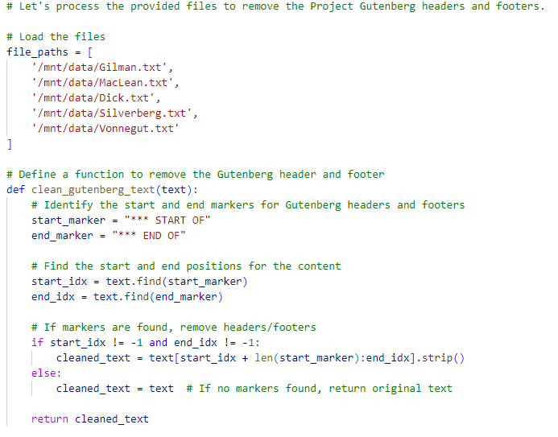

## Tutorial: Combinatorial Texts

For this week's creative code exercise, you're going to be taking influences from NaNoGenMo but work smaller to create a procedurally-generated, combinatorial short story or poem inspired by *Taroko Gorge*. This prompt draws on some of the controversy around NaNoWriMo and, of course, the questions of AI authorship and particularly the questions of who's doing the authoring that generative text engages. 

Instead of asking the LLM to produce text, as we did in our IF prototyping work, you'll be drawing from a number of public domain or creative commons source texts and using procedural methods to combine them. As with the [distant read demo](distant_read.md), I recommend selecting your source texts from Project Gutenberg, but you are welcome to select any set of short stories appropriately licensed for this usage.

### Cut and Paste Text

For examples of the type of work we're going to be creating here, start by [reading the overview on the NaNoGenMo repository](https://nanogenmo.github.io/).  I also recommend checking out the NaNoGenMo works featured in the Electronic Literature Collection Volume 4, particularly [Lee Tusman's "Pomelo: A Book of Instructions and Drawings" inspired by Yoko Ono's work](https://collection.eliterature.org/4/pomelo-a-yoko-ono-grapefruit-generator); [Delacannon's "Old School Dungeon Crawler GameBook Generator"](https://collection.eliterature.org/4/oldschool-dungeon-crawler-gamebook-generator); [Nick Montfort's minimalist experiment "consequence"](https://collection.eliterature.org/4/consequence); [Liza Daly's kinetic "A Physical Book"](https://collection.eliterature.org/4/a-physical-book). These are all much more ambitious projects than you'll be taking on for this exercise, but they speak to the larger goals of this unit.

Next, source at least five text files to work with for your project. Plain text files will work best. For my examples, I used a set of science fiction short stories found in Project Gutenberg. As before, you'll need to ask it to pre-process the texts: however, this week, make sure to check the output as you go. When working with ChatGPT, select "View Analysis" after you ask for pre-processing. For instance, here's a sample of the Python code that ChatGPT 4.0 generated in response to my request to pre-process the Project Gutenberg files and remove the header and footer text: you can see the full script created for this stage [here](sample_cleaning.py). 

Try to use the information you see and any previous experience you have with Python to debug problems by asking ChatGPT for specific changes that might lead to better outcomes: this will be a challenge, but it can lead to great results!

Once you have at least five cleaned files that you're happy with, start asking ChatGPT to transform and/or combine the text(s) using different methods. Take a look through [Zach Whalen's NaNoGenMo Workshop](https://zachwhalen.notion.site/NaNoGenMo-Workshop-b984ee239e9e4cb8a99eb69fda617204) and this week's readings for ideas on how to approach combining your texts - and yes, you can explain the project to ChatGPT and ask it for suggestions as well. Here's a few of the methods you might try, both on individual texts and on re-mixed texts:

- *Find and Replace* - Consider replacing specific words, swapping character names between stories, changing characters from humans to cats (and so on), or using a deterministic method: [Zach Whalen's overview has several examples](https://zachwhalen.notion.site/Find-and-Replace-3eb80d9ef13048469e37a43beb193047).
- *Erasure / Lipogram* - Try to exclude a letter of the alphabet from your texts, and consider the results. You might have to get creative with this or decide to embrace some of the nonsense that will likely remain. You can also eliminate certain words or categories of words.
- *Cento* - A cento is a text composed entirely out of other texts: ask ChatGPT to work across your texts to assist with this type of combinatorial process. For ideas on how to think about this type of constraint, take a look at [Christopher Higgs on the history of the Oulipo and "potential" literature](https://agnionline.bu.edu/essay/the-annoying-lacuna-one-unofficial-history-of-the-oulipo/).

### Shareable Story or Poem

Continue iterating through at least five different approaches until you have a single "story text" that you are happy with. 

Once you have your story text, ask ChatGPT to convert it to an HTML format that's better for display. This doesn't need to be fancy, and should be inspired by the web poetics of Taroko Gorge - it can cycle through possibilities or use a static display at this stage. 

As with our interactive fiction, upload your HTML version to GitHub and use the Pages link to submit to Moodle.