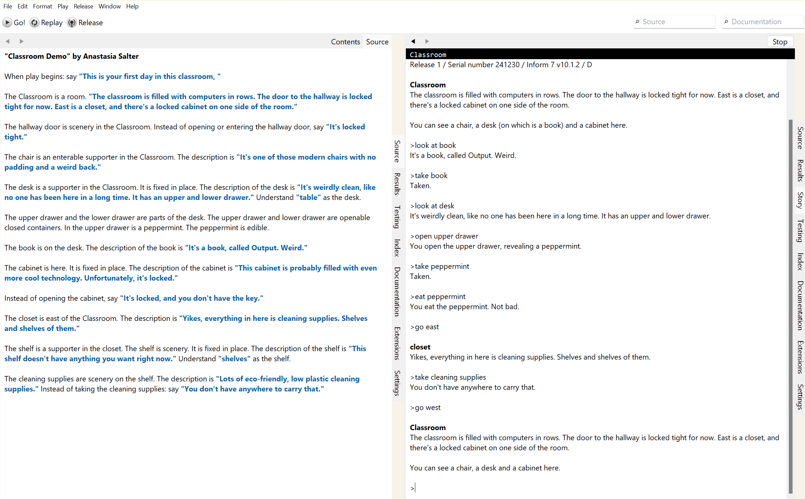

## Inform 7 Demo: Building a First Room

This week, we'll be working through the first components of Inform 7. For reference, refer to Stephen Granade's [guide to making a basic interactive fiction](http://www.brasslantern.org/writers/howto/i7tutorial.html). 

Inform 7 is one of the most prominent examples of a natural language coding system: we'll be using it to think about both the challenges of parsing languages, and the possibilities of code and text as creative tools. Make sure you've followed the directions from Tuesday's class and installed [Inform 7](https://ganelson.github.io/inform-website/) before we meet. 

This week, we're going to cover the basics of rooms and objects. Pay attention to these key words - these are both English descriptions and meaningful words in Inform 7's syntax:

- Rooms
- Directions
- Supporters
- Scenery
- Edible
- Containers
- Fixed in place
- Here
- Openable
- Closed

Here's our sample starter code demonstrating these elements:

~~~
Classroom Demo by Anastasia Salter

When play begins: say "This is your first day in this classroom, "

The Classroom is a room. "The classroom is filled with computers in rows. The door to the hallway is locked tight for now. East is a closet, and there's a locked cabinet on one side of the room."

The hallway door is scenery in the Classroom. Instead of opening or entering the hallway door, say "It's locked tight."

The chair is an enterable supporter in the Classroom. The description is "It's one of those modern chairs with no padding and a weird back."

The desk is a supporter in the Classroom. It is fixed in place. The description of the desk is "It's weirdly clean, like no one has been here in a long time. It has an upper and lower drawer." Understand "table" as the desk.

The upper drawer and the lower drawer are parts of the desk. The upper drawer and lower drawer are openable closed containers. In the upper drawer is a peppermint. The peppermint is edible.

The book is on the desk. The description of the book is "It's a book, called Output. Weird."

The cabinet is here. It is fixed in place. The description of the cabinet is "This cabinet is probably filled with even more cool technology. Unfortunately, it's locked."

Instead of opening the cabinet, say "It's locked, and you don't have the key."

The closet is east of the Classroom. The description is "Yikes, everything in here is cleaning supplies. Shelves and shelves of them."

The shelf is a supporter in the closet. The shelf is scenery. It is fixed in place. The description of the shelf is "This shelf doesn't have anything you want right now." Understand "shelves" as the shelf.

The cleaning supplies are scenery on the shelf. The description is "Lots of eco-friendly, low plastic cleaning supplies." Instead of taking the cleaning supplies: say "You don't have anywhere to carry that." 
~~~

## Paired Exercise

In pairs, build a detailed replica of our current classroom. Select "Create new project" to get started. Be as descriptive as possible, focusing on representing the relationships of the objects all around you. Think about the difference between details that are encoded (like supporter, scenetry, etc.) and details that are meaningful to the player. 

Press "Go" to play your game in progress, and try exploring the space as you create it:

At the end of today's class, we'll share our versions of the classroom briefly: think about how your impressions of objects and their relationships differed from the interpretations of others. This speaks to the complexity of representing the physical world, which will be important later when we discuss AI.